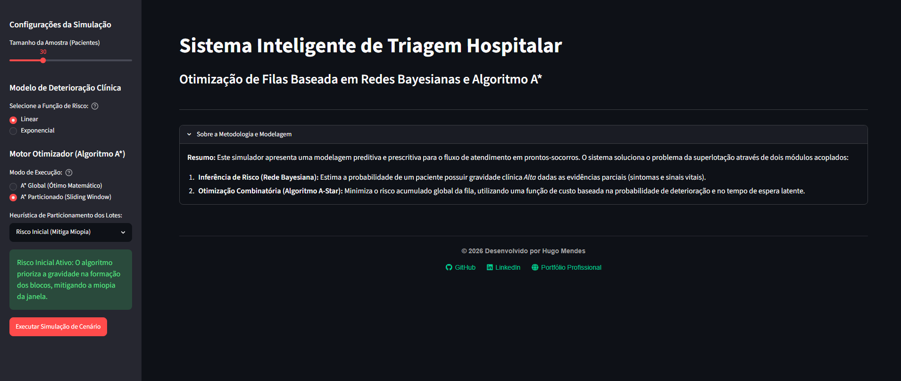

# Sistema Inteligente de Triagem Hospitalar

[](https://sistemadetriagem.streamlit.app/)

Este repositório documenta a implementação de um simulador de triagem médica baseado em Inteligência Artificial. O sistema propõe uma arquitetura computacional híbrida, integrando raciocínio probabilístico sob incerteza e otimização heurística, com o objetivo de mitigar o impacto da superlotação em prontos-socorros.

## Demonstração Online

A aplicação encontra-se disponível para execução diretamente no navegador através do Streamlit Cloud:

> https://sistemadetriagem.streamlit.app/



## 1. Arquitetura do Sistema

A solução é composta por módulos de *Backend* matemático orquestrados por uma interface gráfica analítica (Dashboard) desenvolvida no framework `Streamlit`:

### 1.1. Inferência Bayesiana Diagnóstica (Modelagem Preditiva)
Implementada sob a biblioteca `pgmpy`, a rede bayesiana estima a probabilidade de um paciente apresentar quadro clínico de gravidade Alta, dadas as evidências sintomatológicas observadas (Idade Avançada, Doença Crônica, Saturação de O2, Frequência Cardíaca, Nível de Dor e Febre). O nó Gravidade é condicionado por seis evidências binárias, resultando em uma Tabela de Probabilidade Condicional (CPT) com 64 combinações possíveis de estados. A inferência é processada através do algoritmo exato *Variable Elimination*, otimizado por uma camada de *memoization* que reduz consultas repetidas para um tempo de acesso médio $\mathcal{O}(1)$.

### 1.2. Motor de Busca Heurística (Algoritmo A*)
Responsável por formular a ordenação de atendimento como um problema de minimização de risco clínico global. Para demonstrar o domínio sobre o *trade-off* de escalabilidade computacional, o motor oferece duas modalidades de execução:

* **A* Global (Busca Completa):** Explora o espaço de estados completo. Para evitar o travamento do sistema devido à complexidade fatorial $\mathcal{O}(N!)$, possui uma trava estrutural de segurança limitando a execução a amostras pequenas ($N \le 8$). Nesta modalidade, o algoritmo permite encontrar a melhor solução observada para o conjunto analisado.
* **A* Particionado (*Sliding Window*):** Para contornar a explosão combinatória em filas extensas ($N > 8$), o sistema aplica o método de particionamento do espaço de estados. A complexidade é mitigada para aproximadamente $\mathcal{O}(\lceil N/k \rceil \times k!)$ através do processamento independente de lotes de tamanho $k$, introduzindo deliberadamente a "miopia local" inerente a arquiteturas escaláveis.

### 1.3. Configurações Experimentais
O simulador atua como uma bancada de provas interativa, permitindo parametrizar:

**Modelos de Deterioração Clínica (Funções de Risco):**
* Risco Linear: $f(t) = P(Alta) \times t$
* Risco Exponencial: $f(t) = P(Alta) \times e^{t/\tau}$

**Estratégias de Particionamento (Mitigação de Miopia):**
* Aproximação FIFO: Ordenação dos lotes de forma estritamente temporal.
* Risco Inicial: Ordenação heurística baseada no risco gravidade/tempo de espera inicial para a formação dos blocos.

### 1.4. Painel Analítico e Auditoria (*Business Intelligence*)
A camada de apresentação conta com a biblioteca `plotly` para visualização de dados em padrão industrial:
* **Perfil Clínico (Input):** Histograma de distribuição diagnóstica mapeando o volume de pacientes gerados pela Rede Bayesiana por categoria de risco.
* **Comparativo de Risco (Output):** Contraste visual explícito entre a inércia estrutural (FIFO), o limite heurístico (Gulosa) e o motor A*.
* **Auditoria:** Exportação nativa das matrizes de permutação (.csv) e tabelas de *logs* transacionais para validação em *softwares* estatísticos de terceiros.

## 2. Requisitos de Ambiente

A execução do sistema requer o seguinte ambiente de desenvolvimento configurado:
* Python 3.12 ou superior
* Poetry (Gerenciamento de dependências e ambientes virtuais)
* Make (Automação de rotinas de validação)

## 3. Instruções de Instalação e Execução

1. Realize a clonagem do repositório localmente:
```bash
git clone https://github.com/fhugomp/sistema-triagem-ia.git
```

2. Abra a pasta do projeto:
```bash
cd sistema-triagem-ia
```

3. Instale as dependências via Poetry:
```bash
poetry install
```

4. Inicialize a interface de simulação:
```bash
make run
```

## 4. Validação e Qualidade de Software

A base de código é submetida a uma esteira rigorosa de validação, englobando testes lógicos unitários (Pytest), análise estática de tipagem (Mypy) e formatação padronizada (Ruff).

Para executar a suíte de testes lógicos de forma isolada:

```bash
make test
```

Para executar a esteira de validação e verificação completa:

```bash
make check-all
```

## 5. Estrutura do Repositório

```text
sistema-triagem-ia/
├── docs/
├── src/
│   ├── data/
│   ├── models/
│   ├── optimization/
│   ├── config.py
├── tests/
├── pyproject.toml
├── Makefile
└── README.md
└── main.py
```

### Principais Componentes
```text
bayesian_net.py  -  Inferência probabilística
a_star.py  -  Busca heurística
baselines.py  -  Estratégias FIFO e Gulosa
generator.py  -  Geração de pacientes sintéticos
main.py  -  Interface Streamlit
```

## 6. Considerações Metodológicas

O presente simulador constitui um ambiente experimental robusto para a validação da Teoria de Escalonamento (Scheduling Theory). Os experimentos indicam que, ao dispor de visibilidade global (amostras $\le 8$), o motor A* produz soluções equivalentes aos melhores resultados observados entre as estratégias avaliadas.

A degradação de desempenho observada em cenários superlotados ($N = 100$) não é sintoma de fragilidade de modelagem, mas sim o comportamento esperado do particionamento (Sliding Window). A perda proposital de precisão frente a algoritmos puramente gulosos consolida o trade-off estrutural intrínseco à Computação Clássica: a necessidade imperativa de abdicar do ótimo global para garantir viabilidade e escalabilidade temporal na tomada de decisão em ambientes hospitalares críticos.